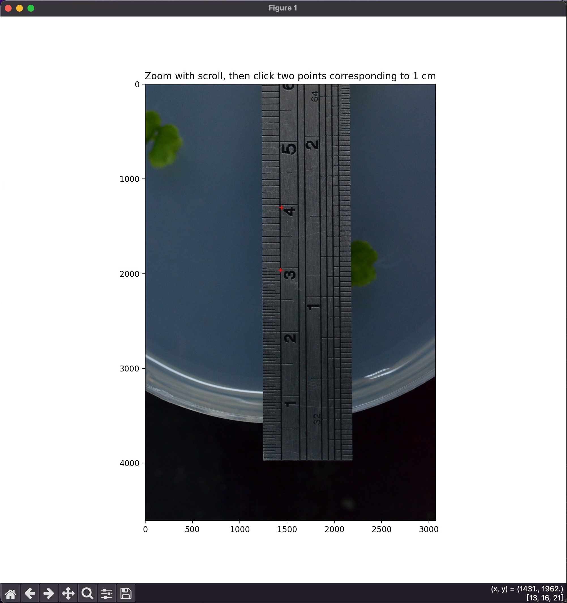

# Plant Area Calculator

A simple tool to calculate the thallus area of *Marchantia polymorpha* using image analysis.

## Installation

Ensure you have Python installed. Then, install the required dependencies using:

```bash
pip install -r requirement.txt
```

## Usage

1. **Calibrate Scale**  
   First, calculate how many pixels correspond to one centimeter:

   ```bash
   python scale.py --input Sample/scale.jpg
   ```

   This script will return a value like:
   
   ```
   1 cm = ... pixels
   ```

2. **Calculate Thallus Area**  
   Use the pixel-per-centimeter value obtained from the calibration to calculate the thallus area:

   ```bash
   python main.py --input Sample/fig --output Sample/fig/result --pixels_per_cm <pixels_per_cm> --min_area_cm <min_area(cm)> [--lowerG <lower_HSV>] [--upperG <upper_HSV>] [--text_file <output_text_file>] [--font_scale <scale>] [--text_color <B,G,R>]
   ```

   - `--input`: Path to the folder containing the images.
   - `--output`: Path to the folder where the result images and data will be saved.
   - `--pixels_per_cm`: The number of pixels per centimeter (from the scale calibration).
   - `--min_area_cm`: Minimum area threshold in cm² to filter out small objects (default is 0.1 cm²).
   - `--lowerG`: Lower HSV bound for green detection (default: (25, 70, 30)).
   - `--upperG`: Upper HSV bound for green detection (default: (80, 255, 255)).
   - `--text_file`: Name of the output text file to save results (default: "data.txt").
   - `--font_scale`: Scale of the text annotations in the image (default: 3).
   - `--text_color`: Color of the annotation text in BGR format (default: (255, 255, 255)).

## Output

Running the script will generate the following outputs in the specified output directory:

- **data.txt**: A text file listing the measured areas of detected thallus regions.
- **Annotated Images (e.g., M1-17.jpg)**:
  - **Blue contours** highlight areas with sizes ≥ `min_area_cm`.
  - **Red contours** indicate areas smaller than `min_area_cm`.

You can adjust the `min_area_cm` parameter based on the visual feedback from these annotated images to fine-tune the detection.

## Example

```bash
python scale.py --input Sample/scale.JPG
# click two points corresponding to 1 cm
# Output: 1 cm = 661.34 pixels
```

```bash
# batch figure
python main.py --input Sample/fig --output Sample/fig/result --pixels_per_cm 661.34 --min_area_cm 0.01
# single figure
python main.py --input Sample/fig.jpg --output Sample/result --pixels_per_cm 661.34 --min_area_cm 0.01
```

---

Feel free to contribute or report issues to improve the functionality!

